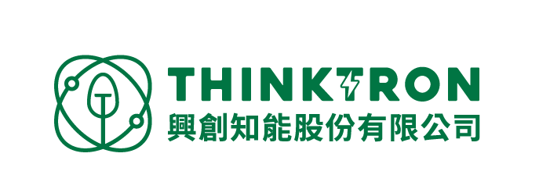

# cesium-tools

[中文README](./docs/README.zh.md)

Cesium utility library providing common functions for map interaction, geospatial calculation, drawing, navigation, tracking, and conversion, suitable for CesiumJS application development.

## Installation

For local development (recommended to use npm link):

```bash
cd cesium-tools
npm install
npm run build
npm link
# Back to your main project
cd ../
npm link cesium-tools
```

## Usage

```ts
import { DrawTool, TrackTool, CommonTool, NavigateTool, ConvertTool, LayerTool } from 'cesium-tools'
import type { Position, Angle, MapParams, CameraParams } from 'cesium-tools'

// Example: Calculate distance
const dist = CommonTool.calculateDistance(pos1, pos2)

// Example: Drawing
const draw = new DrawTool(viewer)
draw.startDraw('polyline')

// Example: Mouse tracking
const track = new TrackTool(viewer)
track.trackMousePosition(100, refOutput)
```

## Main Features & API

### CommonTool (Geospatial Calculation & Interaction)
- `calculateDistance(p1, p2)`: Calculate spatial distance between two points
- `getMousePosition(viewer, movement)`: Get mouse geolocation
- `getPositionFromCanvas(viewer, x, y)`: Convert screen coordinates to geolocation
- `getMapParams(viewer)`: Get map center, scale, width, height, etc.
- `getCameraParams(viewer)`: Get camera extrinsic parameters

### DrawTool (Drawing)
- `startDraw(drawType)`: Start drawing (polyline, polygon)
- `stopDraw()`: Stop drawing
- `createLine(positions, options, lineType)`: Create line entity
- `createPolygon(positions, options)`: Create polygon entity

### TrackTool (Tracking)
- `trackMousePosition(freq, refOutput)`: Track mouse geolocation
- `trackMapParams(freq, refOutput)`: Track map parameters
- `trackCameraParams(freq, refOutput)`: Track camera parameters

### NavigateTool (Navigation)
- `lockPOV(position, heading, pitch, range)`: Lock point of view
- `lockCurrentPOV()`: Lock current POV
- `unlockPOV()`: Unlock POV
- `rotateMap(target)`: Smoothly rotate map
- `zoomIn()` / `zoomOut()`: Zoom in/out

### ConvertTool (Coordinate/Angle Conversion)
- `C3ToPosition(cartesian3)`: Convert Cartesian3 to geolocation
- `DegToRad(deg)` / `RadToDeg(rad)`: Degree/radian conversion
- ... (see convert.ts for more)

### LayerTool (Layer Management)
- ... (see layers.ts for more)

## Type Definitions

- `Position`: Geolocation (longitude, latitude, angle, height, Cartesian3)
- `Angle`: Angle (degree, radian)
- `MapParams`: Map parameters
- `CameraParams`: Camera parameters

## Directory Structure

```
cesium-tools/
├── src/
│   ├── common.ts
│   ├── convert.ts
│   ├── draw.ts
│   ├── index.ts
│   ├── layers.ts
│   ├── navigate.ts
│   ├── track.ts
│   └── types/
│       ├── index.ts
│       ├── params.ts
│       └── position.ts
├── package.json
├── tsconfig.json
├── LICENSE
└── README.md
```

## Authors

- **Willie Wu** - *Owner* - [sw-willie-wu](https://github.com/sw-willie-wu)

See also the list of [contributors](./docs/contributors.md) who participated in this project.

## License

See the [licence](./LICENSE) for more informations.

## Acknowledgments

Special thanks to all contributors, testers, and advisors of this project, as well as the CesiumJS team and the open-source community for their technical support.

In particular, special thanks to:

[](https://www.thinktronltd.com/)

This project also benefits from many open-source projects, to which we express our gratitude.
